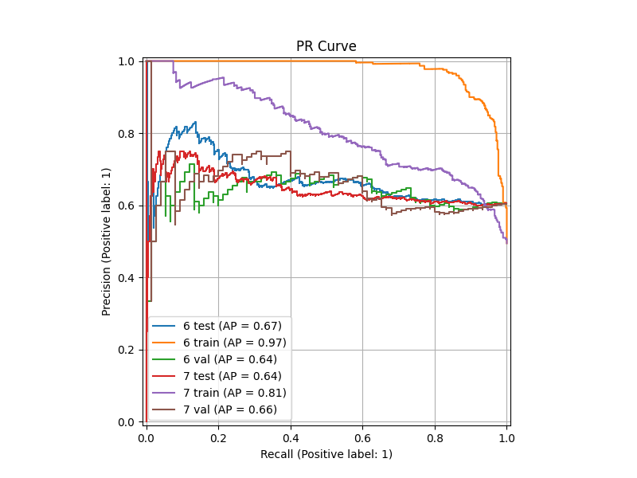
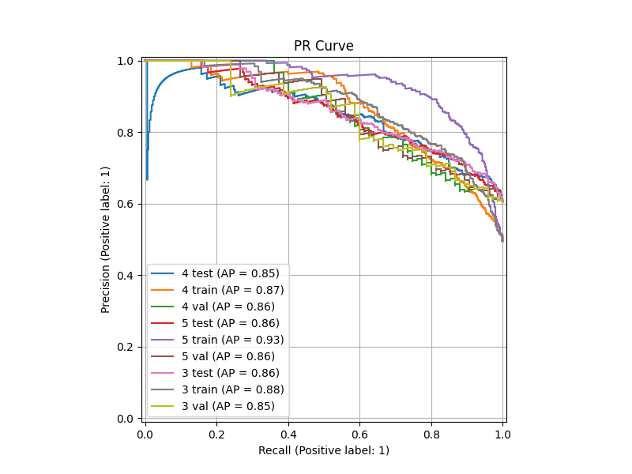
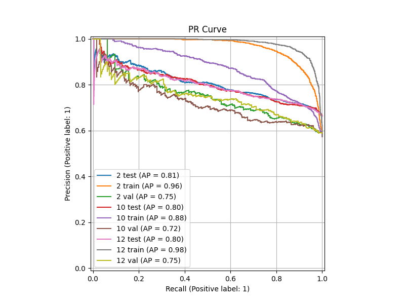
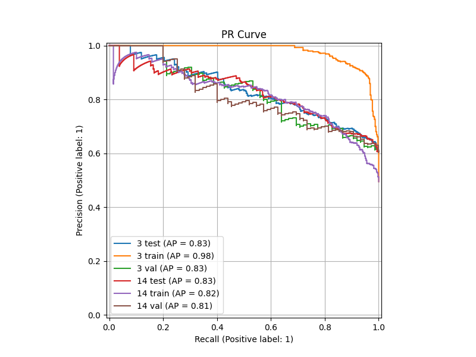
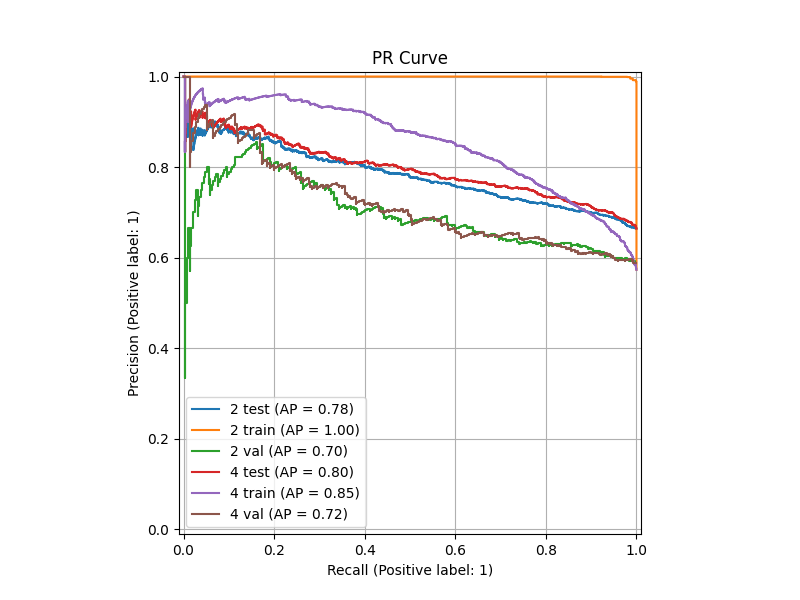
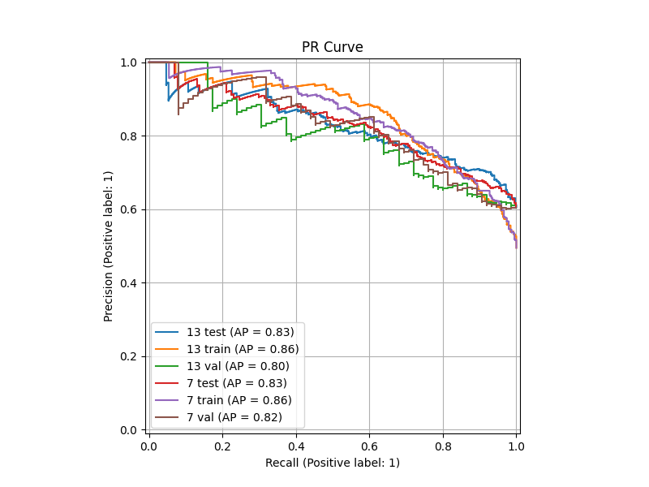

# README LOG

## 2026-02-21 Эксперименты с классическими моделями построенными на video-to-text данных

- Код экспериментов `./src/text_exp_ml_video.py` 
- Использованы датасеты ./data/input/video-text/BAH_train_Qwen3-VL-4B-Instruct.csv, датасеты 4fps дают результаты хуже
- Лучший результат TF-IDF (500 features) + CatBoost (6 эксперимент)
- 

- Результаты

|    |   name | dtype   |   thr |     f1 |    roc |     pr |
|----|--------|---------|-------|--------|--------|--------|
|  0 |      6 | test    |   0.5 | 0.5615 | 0.5639 | 0.6691 |
|  2 |      5 | test    |   0.5 | 0.5579 | 0.5616 | 0.6484 |
|  4 |      1 | test    |   0.5 | 0.5473 | 0.5517 | 0.6474 |
|  9 |      7 | test    |   0.5 | 0.5229 | 0.5371 | 0.644  |
| 10 |      3 | test    |   0.5 | 0.5156 | 0.5168 | 0.6239 |
| 16 |      5 | train   |   0.5 | 0.9486 | 0.9941 | 0.9939 |
| 17 |      1 | train   |   0.5 | 0.9485 | 0.9941 | 0.9939 |
| 18 |      3 | train   |   0.5 | 0.9434 | 0.9929 | 0.9927 |
| 19 |      6 | train   |   0.5 | 0.9112 | 0.9709 | 0.9749 |
| 22 |      7 | train   |   0.5 | 0.7159 | 0.808  | 0.8053 |
| 28 |      7 | val     |   0.5 | 0.5735 | 0.5378 | 0.6561 |
| 29 |      3 | val     |   0.5 | 0.5454 | 0.5118 | 0.6419 |
| 30 |      6 | val     |   0.5 | 0.5441 | 0.5456 | 0.6355 |
| 32 |      5 | val     |   0.5 | 0.5204 | 0.5159 | 0.6128 |
| 33 |      1 | val     |   0.5 | 0.5141 | 0.5088 | 0.5957 |

- Эксперименты с эмбеддингами / дообучением трансформеров показали результаты хуже

# 2026-02-16 Эксперименты с дообучением transformers

- Код лежит тут `src/text_exp_train_transformers.py`
- Лучший результат у модели "michellejieli/emotion_text_classifier" (3)
- 

- Метрики экспериментов

|   name |   f1_mean |   f1_std |   roc_mean |   roc_std |   pr_mean |   pr_std |
|--------|-----------|----------|------------|-----------|-----------|----------|
|      4 |    0.699  |   0.0062 |     0.7716 |    0.0203 |    0.8516 |   0.0073 |
|      3 |    0.6899 |   0.0221 |     0.7774 |    0.0208 |    0.8567 |   0.0069 |
|      5 |    0.6868 |   0.0255 |     0.7757 |    0.013  |    0.8584 |   0.0015 |
|      7 |    0.6862 |   0.0059 |     0.7762 |    0.0145 |    0.8506 |   0.0074 |
|      1 |    0.6724 |   0.0156 |     0.756  |    0.0115 |    0.836  |   0.014  |
|      2 |    0.6706 |   0.0252 |     0.7468 |    0.0372 |    0.8248 |   0.0194 |
|      6 |    0.662  |   0.0285 |     0.7629 |    0.0341 |    0.8461 |   0.0123 |

- Метрики по разбиениям

|    |   name | dtype   |   thr |     f1 |    roc |     pr |
|----|--------|---------|-------|--------|--------|--------|
|  0 |      3 | test    |   0.5 | 0.7055 | 0.7921 | 0.8616 |
|  1 |      5 | test    |   0.5 | 0.7048 | 0.7849 | 0.8573 |
|  2 |      4 | test    |   0.5 | 0.6946 | 0.786  | 0.8465 |
|  3 |      7 | test    |   0.5 | 0.6903 | 0.7865 | 0.8558 |
|  4 |      1 | test    |   0.5 | 0.6835 | 0.7641 | 0.8459 |
|  5 |      6 | test    |   0.5 | 0.6821 | 0.787  | 0.8548 |
|  6 |      2 | test    |   0.5 | 0.6527 | 0.7205 | 0.8111 |
|  7 |      5 | train   |   0.5 | 0.8404 | 0.9227 | 0.9317 |
|  8 |      6 | train   |   0.5 | 0.7826 | 0.8509 | 0.8596 |
|  9 |      7 | train   |   0.5 | 0.7802 | 0.8663 | 0.8791 |
| 10 |      3 | train   |   0.5 | 0.7799 | 0.869  | 0.8793 |
| 11 |      4 | train   |   0.5 | 0.7583 | 0.8516 | 0.8676 |
| 12 |      1 | train   |   0.5 | 0.7422 | 0.8311 | 0.8389 |
| 13 |      2 | train   |   0.5 | 0.7262 | 0.8175 | 0.8266 |
| 14 |      4 | val     |   0.5 | 0.7034 | 0.7573 | 0.8568 |
| 15 |      2 | val     |   0.5 | 0.6884 | 0.7731 | 0.8386 |
| 16 |      7 | val     |   0.5 | 0.682  | 0.766  | 0.8454 |
| 17 |      3 | val     |   0.5 | 0.6743 | 0.7627 | 0.8518 |
| 18 |      5 | val     |   0.5 | 0.6688 | 0.7665 | 0.8594 |
| 19 |      1 | val     |   0.5 | 0.6614 | 0.7478 | 0.8261 |
| 20 |      6 | val     |   0.5 | 0.6418 | 0.7388 | 0.8374 |

## 2026-02-15 Эксперименты с текстом из frames-split/ (эмбеддинги + catboost)

- Повторил эксперименты из `src/text_exp_transformers.py` код лежит в `src/text_exp_frames_transformers.py`
- Лучший результат у эмбеддингов `michellejieli/emotion_text_classifier" + CatBoost (2)
- График PR 
- Метрики экспериментов

|   name |   f1_mean |   f1_std |   roc_mean |   roc_std |   pr_mean |   pr_std |
|--------|-----------|----------|------------|-----------|-----------|----------|
|     12 |    0.627  |   0.0112 |     0.6844 |    0.0015 |    0.7744 |   0.0352 |
|      2 |    0.6262 |   0.0011 |     0.6846 |    0.0095 |    0.7803 |   0.0382 |
|      9 |    0.6262 |   0.0011 |     0.6846 |    0.0095 |    0.7803 |   0.0382 |
|      3 |    0.6178 |   0.003  |     0.682  |    0.0125 |    0.7767 |   0.0419 |
|     11 |    0.6123 |   0.0055 |     0.6893 |    0.0006 |    0.7896 |   0.0245 |

|    |   name | dtype   |   thr |     f1 |    roc |     pr |
|----|--------|---------|-------|--------|--------|--------|
|  0 |      2 | test    |   0.5 | 0.6269 | 0.6913 | 0.8073 |
|  1 |      9 | test    |   0.5 | 0.6269 | 0.6913 | 0.8073 |
|  2 |      3 | test    |   0.5 | 0.6199 | 0.6908 | 0.8063 |
|  3 |     12 | test    |   0.5 | 0.619  | 0.6833 | 0.7993 |
|  4 |     10 | test    |   0.5 | 0.6143 | 0.6816 | 0.8024 |
|  5 |     11 | test    |   0.5 | 0.6084 | 0.6889 | 0.8069 |
| 14 |     11 | train   |   0.5 | 0.9185 | 0.9815 | 0.9878 |
| 16 |     12 | train   |   0.5 | 0.8961 | 0.9709 | 0.9799 |
| 18 |      2 | train   |   0.5 | 0.8731 | 0.9461 | 0.9638 |
| 19 |      9 | train   |   0.5 | 0.8731 | 0.9461 | 0.9638 |
| 20 |      3 | train   |   0.5 | 0.8698 | 0.9458 | 0.9636 |
| 28 |     12 | val     |   0.5 | 0.6349 | 0.6854 | 0.7495 |
| 29 |      2 | val     |   0.5 | 0.6254 | 0.6778 | 0.7533 |
| 30 |      9 | val     |   0.5 | 0.6254 | 0.6778 | 0.7533 |
| 31 |     11 | val     |   0.5 | 0.6162 | 0.6897 | 0.7723 |
| 33 |      3 | val     |   0.5 | 0.6156 | 0.6731 | 0.7471 |

## 2026-02-14 Эксперименты с текстом из split/ (эмбеддинги + catboost)

- Провел 14 экспериментов код `src/text_exp_transformers.py`
- Лучший результат у эмбеддингов "j-hartmann/emotion-english-distilroberta-base" + Bagging of 20 CatBoost (14)
- График PR 
- Метрики экспериментов

|   name |   f1_mean |   f1_std |   roc_mean |   roc_std |   pr_mean |   pr_std |
|--------|-----------|----------|------------|-----------|-----------|----------|
|     12 |    0.7037 |   0.0276 |     0.7442 |    0.0241 |    0.8178 |   0.0223 |
|      3 |    0.6846 |   0.0023 |     0.7466 |    0.0195 |    0.83   |   0.0054 |
|     10 |    0.6686 |   0.0053 |     0.7434 |    0.0223 |    0.8267 |   0.0107 |
|     14 |    0.6658 |   0.025  |     0.7352 |    0.0315 |    0.814  |   0.0175 |
- Метрики по разбиениям

|    |   name | dtype   |   thr |     f1 |    roc |     pr |
|----|--------|---------|-------|--------|--------|--------|
|  1 |     12 | test    |   0.5 | 0.6842 | 0.7612 | 0.8336 |
|  2 |     14 | test    |   0.5 | 0.6835 | 0.7575 | 0.8264 |
|  7 |     10 | test    |   0.5 | 0.6724 | 0.7591 | 0.8342 |
| 14 |     12 | train   |   0.5 | 1      | 1      | 1      |
| 24 |      3 | train   |   0.5 | 0.9138 | 0.9753 | 0.9775 |
| 25 |     10 | train   |   0.5 | 0.8596 | 0.9499 | 0.9533 |
| 27 |     14 | train   |   0.5 | 0.7537 | 0.833  | 0.831  |
| 28 |     12 | val     |   0.5 | 0.7232 | 0.7271 | 0.802  |
| 32 |      3 | val     |   0.5 | 0.683  | 0.7328 | 0.8262 |
| 36 |     10 | val     |   0.5 | 0.6649 | 0.7276 | 0.8191 |
| 38 |     14 | val     |   0.5 | 0.6481 | 0.7129 | 0.8016 |

## 2026-02-08 Эксперименты с текстом из split-frames/ (! все кусочки разговора имеют одну метку)

- Провел 5 экспериментов исходный код `src/text_frames.py`
- Лучший результат у LogReg (4)
- График PR Curve `data/experiments/exp_2/chart.png` (4 - LogReg, 2 - CatBoost)

- Метрики экспериментов (средние)

|   name |   f1_mean |   f1_std |   roc_mean |   roc_std |   pr_mean |   pr_std |
|--------|-----------|----------|------------|-----------|-----------|----------|
|      2 |    0.5878 |   0.0115 |     0.6414 |    0.0213 |    0.7408 |   0.0599 |
|      3 |    0.5867 |   0.0255 |     0.6406 |    0.0304 |    0.7426 |   0.0661 |
|      5 |    0.5681 |   0.0259 |     0.6507 |    0.029  |    0.7636 |   0.0498 |
|      4 |    0.6086 |   0.0291 |     0.6562 |    0.0373 |    0.7594 |   0.0549 |
|      1 |    0.508  |   0.032  |     0.6357 |    0.0146 |    0.7582 |   0.0368 |

- Все результаты

|    |   name | dtype   |   thr |     f1 |    roc |     pr |
|----|--------|---------|-------|--------|--------|--------|
|  0 |      4 | test    |   0.5 | 0.6292 | 0.6826 | 0.7982 |
|  2 |      2 | test    |   0.5 | 0.596  | 0.6565 | 0.7831 |
|  8 |      4 | train   |   0.5 | 0.7173 | 0.8155 | 0.8525 |
|  6 |      2 | train   |   0.5 | 0.9939 | 0.9998 | 0.9999 |
| 10 |      4 | val     |   0.5 | 0.588  | 0.6299 | 0.7205 |
| 11 |      2 | val     |   0.5 | 0.5797 | 0.6264 | 0.6984 |

## 2026-02-07 Эксперименты с текстом из split/ катбустом и log reg 

- Провел 14 экспериментов суммарно исходный код `src/text_ml.py`
- Лучший результат у гипотез:
- 13 - logreg (TF-IDF 300 фичей) самые сильные слова `but`, `stop`, `usually`  
- 7  - catboost (10 деревьев 500 фичей) самые сильные слова `but`, `been`
- График PR Curve `data/experiments/exp_1/chart.png`

- Все эксперименты тут `data/experiments/results.txt` 
- Таблица со метрикой на test и val - mean и std

|   name |   f1_mean |   f1_std |   roc_mean |   roc_std |   pr_mean |   pr_std |
|--------|-----------|----------|------------|-----------|-----------|----------|
|     13 |    0.6826 |   0.0005 |     0.7359 |    0.0444 |    0.8167 |   0.0185 |
|      7 |    0.6833 |   0.0007 |     0.746  |    0.0197 |    0.8276 |   0.0046 |
|      9 |    0.6737 |   0.0035 |     0.744  |    0.0274 |    0.8298 |   0.0057 |
|     10 |    0.6707 |   0.0076 |     0.75   |    0.0192 |    0.8351 |   0.0013 |
|     11 |    0.6782 |   0.0096 |     0.7426 |    0.0288 |    0.8264 |   0.0112 |
|      6 |    0.6832 |   0.0233 |     0.7471 |    0.0458 |    0.8241 |   0.0269 |
|     14 |    0.6472 |   0.0325 |     0.7046 |    0.0659 |    0.781  |   0.0684 |
|      8 |    0.655  |   0.039  |     0.7355 |    0.0448 |    0.8239 |   0.0148 |
|     12 |    0.5998 |   0.0398 |     0.7251 |    0.0099 |    0.8188 |   0.0226 |
|      5 |    0.6435 |   0.0421 |     0.7196 |    0.0594 |    0.808  |   0.0389 |
|      1 |    0.6628 |   0.0463 |     0.723  |    0.0559 |    0.8105 |   0.0414 |
|      3 |    0.6324 |   0.0558 |     0.7166 |    0.0484 |    0.8057 |   0.0269 |
|      2 |    0.6443 |   0.0641 |     0.7186 |    0.0846 |    0.7996 |   0.0722 |
|      4 |    0.656  |   0.068  |     0.7228 |    0.0582 |    0.8131 |   0.0261 |

- Таблица с фактическим качеством на каждом разбиении

|    |   name | dtype   |   thr |     f1 |    roc |     pr |
|----|--------|---------|-------|--------|--------|--------|
|  4 |      7 | test    |   0.5 | 0.6828 | 0.7599 | 0.8309 |
|  6 |     13 | test    |   0.5 | 0.6823 | 0.7673 | 0.8298 |
| 21 |      7 | train   |   0.5 | 0.7613 | 0.8511 | 0.857  |
| 23 |     13 | train   |   0.5 | 0.7557 | 0.8521 | 0.8584 |
| 29 |      7 | val     |   0.5 | 0.6838 | 0.7321 | 0.8244 |
| 30 |     13 | val     |   0.5 | 0.683  | 0.7045 | 0.8036 |

- Важность слов для LogReg в файле `data/experiments/exp_1/13_imp.csv`
- Важность слов для CatBoost в файле `data/experiments/exp_1/7_imp.csv` 

